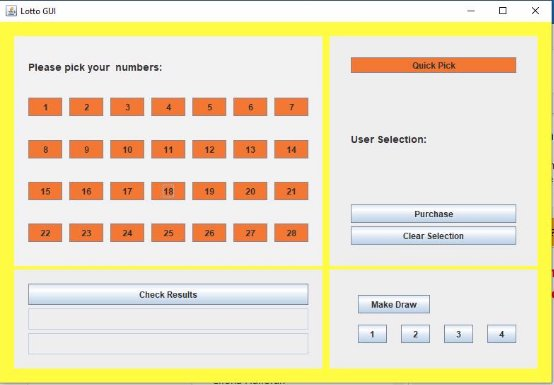

# OOP2 Project

---

**Project   GUI, Event Handling + Handling Exceptions –Lotto Project**

**Design** and **implement** a Java Application **Lotto** Project that the local Napolean Cricket Club to run a weekly lotto

1) Allows the user to select 4 numbers from 28 or
1) Allows the user to randomly select the 4 numbers (quickpick).
1) Allows the Club (separate Panel) to make a draw – i.e.  4 numbers randomly selected from possible 28 (1 to 28)
1) allows a user/operator to check results
1) Include additional functionality 30% of marks)

**Marking Scheme:**

|**Assignment Weighting** |**10% of final module mark** |
| - | - |
|**Topic**  |**% mark** |
|GUI (includes layout, messages etc.) |20 |
|||
|user selection |10 |
|quickpick  |10 |
|make draw |10 |
|check results |20 |
|Additional Feature (document) |30 |
|**Total** |**100** |

**Consider:**

- What will the GUI look like? Sample layout overleaf.
- What events need to be handled?
- What classes/objects will you need?
- What methods/behaviours will you need, e.g. if you store a user's selection in an array you might need to sort that array, you might need to search that array (repeatedly)
- How will your application handle exceptions? (A well-designed GUI should  minimise exceptions)
- How will you test your project?

**Additional Feature:**

- 30% of the marks available are for an additional feature(s) not specified above. You must document your additional feature on Moodle, i.e. write a short description of the additional feature you have provided.

**Assignment Weighting:** 30% of final module mark

**Deliverable(s):**

- **Interim code 1 upload Monday 8/4/24 9am**

  should include uml diagram/ gui design  and code to date – 1 compressed folder Lotto uploaded to Moodle

- **Interim code 2 upload Monday 15/4/24 9am** 1 compressed folder Lotto uploaded to Moodle
- **Final Code - Monday 22/4/24 9am**

  Compressed** Project** Folder named **Lotto** uploaded to Moodle.

  Additional Feature Detail detailed in word document in root folder  uploaded to Moodle.

Customer Acceptance Testing (CAT) will be scheduled for Monday 22/4/24 and Tuesday 23/4/24.  The schedule will be published on Moodle.

**Students who do NOT attend scheduled customer acceptance testing will be awarded** 0 (out of available 30) marks for this assignment.

**Sample Initial Layout:**

Should  you  fail  to upload your work to Moodle before a deadline expires then your mark for the assignment will be subject to a penalty:

**Penalties Scale.**

|***Days Late*** |***Multiply mark by*** |
| - | - |
|1-2 |0\.7 |
|3-4 |0\.5 |
|5-7 |0\.3 |

**Note:** You should backup your work regularly as you are developing. **Issue Date:** Friday 22/3/24
2**

---

